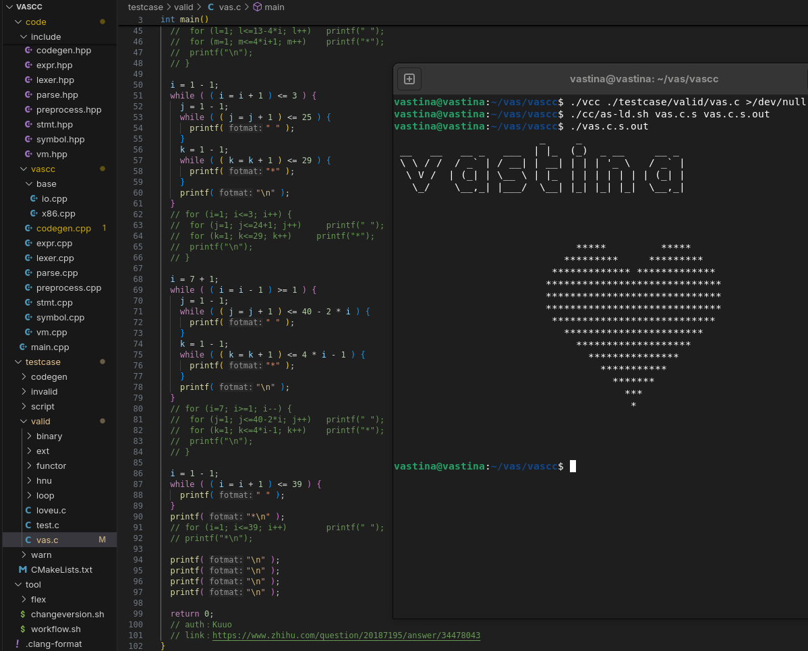

# 自己动手写一个玩具编译的一些感悟
如题，本文并不是一个"从 0 开始实现一个 toy compiler"之类的教程，主要目的只是作个记录

## 
* 写的什么编译器 ？ C -> asm, x86_64-linux
* 源代码在哪？  丢[github](https://github.com/vastina/vascc)了
* 大概花了多久？  两个月，40天有commit，不包括修修补补增加特性（不怎么需要改动原来代码，加新的就好）
* 完成度如何？  说实话，很烂，只能编译一些简单而无聊的程序
* 暂时就这些想到这些

## 
"自己动手写一个编译器"这个想法最开始其实来自于两件很小的事，一是学校某门课提供的一个所谓`minicc`过于的烂了，我当时跟同学说给我一周我就能写出这么个解释器，二是在某网站瞎逛，在一个类似于awesome-tutorial的repo里面发现了一个叫[write_a_c_compiler](https://github.com/nlsandler/write_a_c_compiler)的东西。后面那个教程有什么帮助吗，其实没什么用，不过它倒是突然让我发现写个`lexer`其实非常的简单，然后带着这种“好像也就这样”的态度搓了好些天。说来惭愧，它给的测试脚本我一次也没运行过，因为我不打算先写一个只能编译`int main(){return 0;}`的程序再不断加东西。不过也正是这个原因让我在`Parser`卡了很久。

## 
说来好玩，也正常，我在写编译器的过程中几乎没怎么看过龙书。原因很简单，看不进去，伪代码+看完还是不知道怎么动手让我对它兴趣实在不大。虽然有如"为每个scope创建symble table"之类对我启发很大的话，但大体上还是束之高阁。不得不说的是，抛弃龙书，或者说对理论不耐烦，从一开始就决定了我所以尝试写的编译器的高度。现在我看着以前的代码，不说感觉就是屎山吧，也可以说是没啥美感。`lexer`和`asm codegen`还好，`Parser`确实需要重写，在支持`struct`和`pointer`之前不重写我大概也不会往下继续写了。

## 
要说动手写编译器最大的体会感悟是什么，其实不是看到C就主动去想它汇编长什么样，由于C++基础薄弱，刚开始写的时候我对如何将一堆性质不同的 `Expression` `Statement` 存储到一起并在需要的时候将数据读出来的问题很头痛，几次尝试下来我对继承多态的运用和理解倒是好了不少（笑。

大概是在离最开始过去一个月零几天的时候，我手工写了一个 `helloworld.S`，然后手动调`as`和`ld`生成了一份可以打印“hello world"并正常退出的可执行文件。当时感觉不难，后来写汇编生成的时候大概也是这个感觉（不考虑优化问题），不知道该怎么办了，再来一发`subq  $16, %rsp`吧，8MB的栈不用白不用。

## 
说起来，这是我第一个总代码量达到5k行的project，写下来确实学到体会到不少东西。末，附一张 `vascc` 的图吧

